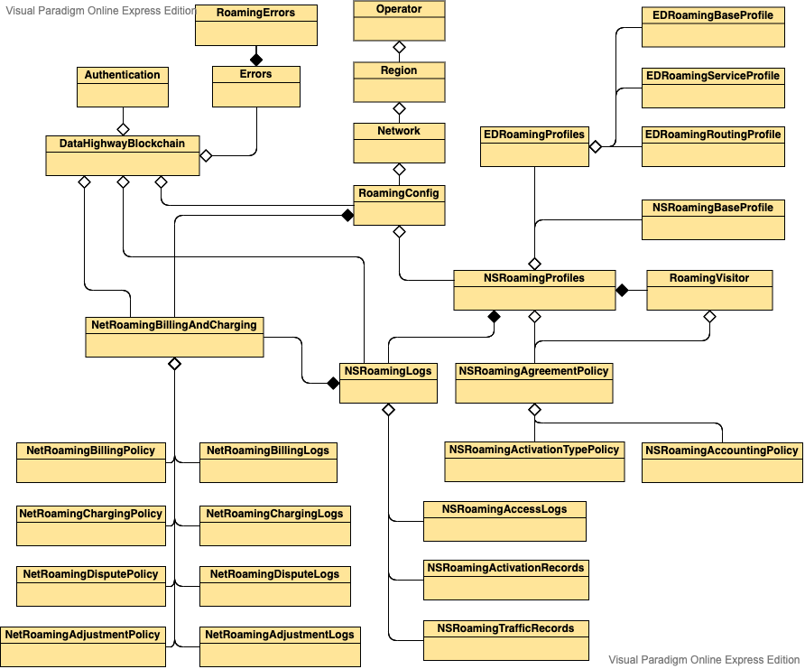

# Introduction

Welcome to the Data Highway API! You can use our API to access Data Highway API endpoints, where you can get information from the Data Highway blockchain's distributed database for:

* TODO - Authentication
* Roaming
* TODO - Mining
* TODO - Inter-chain Data Market

We have language bindings in Shell, Go, and JavaScript! You can view code examples in the dark area to the right, and you can switch the programming language of the examples with the tabs in the top right.

This example API documentation page was created with [Slate](https://github.com/lord/slate). Feel free to edit it and use it as a base for your own API's documentation.

References

* LoRaWAN Backend Interfaces v1.0 Specification https://lora-alliance.org/sites/default/files/2018-04/lorawantm-backend-interfaces-v1.0.pdf
* LoRaWAN Backend Implementation https://github.com/brocaar/lorawan/blob/master/backend/backend.go
* Actility LoRaWAN Roaming Webinar https://www.youtube.com/watch?v=tWP6VV1CKEg
* HTTP Status Code Registry https://www.iana.org/assignments/http-status-codes/http-status-codes.xhtml

<aside class="success">
Remember — a happy roamer is an authenticated roamer!
</aside>
<aside class="warning">Inside HTML code blocks like this one, you can't use Markdown, so use <code>&lt;code&gt;</code> blocks to denote code.</aside>
